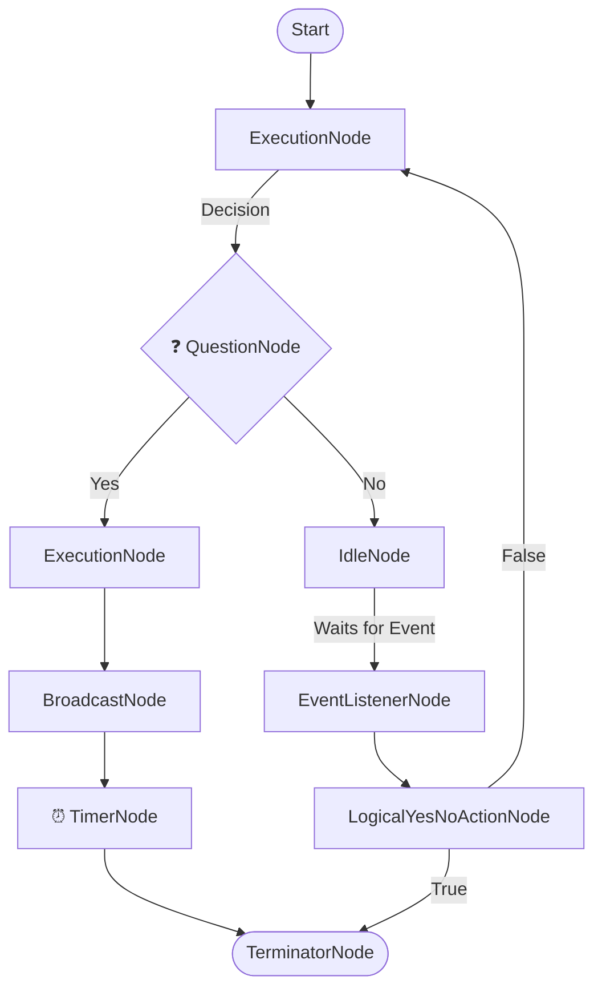

# Nodes

Nodes are the building blocks of the workflow. Each node represents a step in the workflow. The node can be a simple step or a complex step with multiple actions. The node can be a logical step (a decision point) or a task step. The nodes can be connected nodes or free nodes. Free nodes generally listen to events or timers and are not part of the main or secondary workflow graphs. Connected nodes are part of the main or secondary workflow graphs or node chains. 

Here is the simple example.

## Types of Nodes

Currently following types of the nodes are supported:

- [Execution Node](nodes/node.md#execution-node)
- [Question Node](nodes/node.md#question-node)
- [Event Listener Node](nodes/node.md#event-listener-node)
- [Logical Yes-No Action Node](nodes/node.md#logical-yes-no-action-node)
- [Logical Event Node](nodes/node.md#logical-event-node)
- [Logical Timer Node](nodes/node.md#logical-timer-node)
- [Timer Node](nodes/node.md#timer-node)
- [Terminator Node](nodes/node.md#terminator-node)
- [Broadcaster Node](nodes/node.md#broadcaster-node)
- [Idle Node](nodes/node.md#idle-node)

## Node Members

Every node has some common properties. These are:

1. [Node Actions](nodes/node-actions.md) - *Node actions or tasks are the actions associated with the node. These actions are executed when the node is triggered. Node execution does not move to the next node until all the actions are executed successfully.*
2. [Node Rule](nodes/node-rule.md) - *(Optional) A decision rule associated with the node. A rule may have hierarchical set of conditions within them.*
3. [Node Execution Delay](nodes/node-execution-delay.md) - *(Optional) This is the delay before the node actions are executed. This is defined in seconds*
4. [Node Input](nodes/node-input.md) - *(Optional) This is input data expected for a particular type of the node.*

In addition to these, there are some specific properties which change according to the node type.
